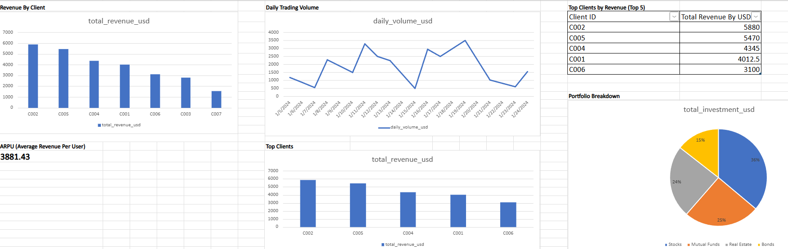

# 💼 Financial Transactions Data Engineering Project

This project simulates a real-world ETL pipeline and KPI analytics workflow for a financial firm managing global client transactions. The project was built entirely using SQL (DuckDB) for ETL, KPI calculation, and Excel for dashboard visualization.

---

## 🧠 Business Context

A financial company handles hundreds of daily transactions from international clients across different currencies. Management needs reliable KPIs to track revenue, client activity, and portfolio distribution — but raw data is messy, inconsistent, and non-standardized.

This project solves that by building a clean ETL pipeline to transform raw transaction data into a powerful source of business insight.

---

## 🚀 Solution Overview

### ETL Pipeline Flow:

1. Load raw data from CSV  
2. Clean & standardize the data (currency conversion, date formatting, removing duplicates)  
3. Apply Slowly Changing Dimensions (SCD) to track client profile changes  
4. Generate KPIs using clean analytical tables  
5. Visualize results in Excel dashboard  

---

## 🛠️ Tech Stack

- SQL (DuckDB style)  
- DuckDB  
- Excel (Online) for dashboard visualization  
- GitHub for version control & project showcasing  

---

## 📁 Folder Structure

```text
etl_finance/
├── data/                      # Raw source data
│   └── transactions.csv
│
├── etl/                       # ETL SQL scripts
│   ├── load_transactions.sql
│   ├── clean_transactions.sql
│   └── scd_clients.sql
│
├── kpi_analytics/             # KPI calculation SQL queries
│   ├── revenue_by_client.sql
│   ├── daily_trading_volume.sql
│   ├── arpu.sql
│   ├── top_clients.sql
│   ├── top_clients_by_revenue.sql
│   └── portfolio_breakdown.sql
│
├── tests/                     # Testing & validation scripts
│   └── README.md
│
├── docs/                      # Deliverables
│   ├── etl_finance_dashboard.xlsx
│   └── dashboard_preview.png
│
└── README.md

---

## 📊 KPI Overview

| SQL Query                      | Description                                    |
|--------------------------------|------------------------------------------------|
| `revenue_by_client.sql`        | Total revenue per client (USD)                |
| `daily_trading_volume.sql`     | Total transaction volume per day (USD)        |
| `arpu.sql`                     | Average Revenue Per User (ARPU)               |
| `top_clients.sql`              | Top 5 clients by total revenue                |
| `top_clients_by_revenue.sql`   | Top 10 clients ranked by revenue              |
| `portfolio_breakdown.sql`      | Portfolio breakdown by asset type (USD & %)  |

---

## 📈 Dashboard Preview

Interactive Excel dashboard visualizing all KPIs and trends.



📥 [Download the full Excel Dashboard here](docs/etl_finance_dashboard.xlsx)

---

## 🎯 Project Highlights

- ✅ Clean ETL pipeline fully in SQL  
- 📊 Realistic business KPIs for financial analytics  
- 📈 Excel dashboard for visualization  
- 🧠 Structured like a real-world BI/Data Engineering project  
- 🧱 Beginner-friendly but professional-standard  
